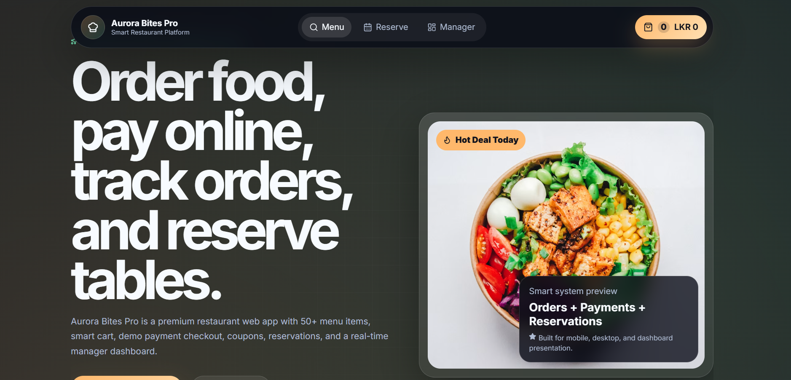
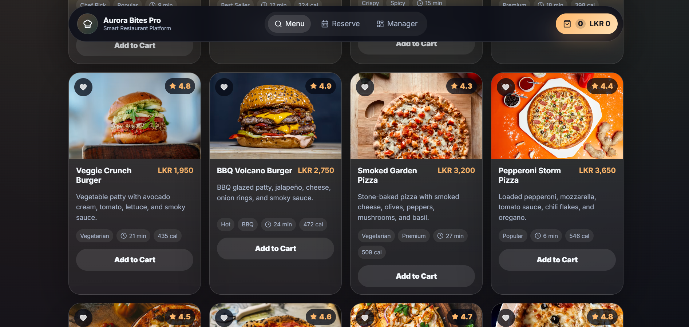

# Aurora Bites Pro — Smart Restaurant Website & Manager Dashboard

A premium modern restaurant web application built with **React, Vite, Firebase Firestore, Motion animations, Recharts, and responsive CSS**.

This version is upgraded from a simple restaurant website into a more powerful internship showcase project with many food items, online ordering, demo payment flow, order tracking, table reservation, coupons, favorites, and a real-time manager dashboard.
Project description paragraph...

## Project Screenshots

### Manager Dashboard

### Menu Interface


## Main Features

### Customer Website

- Premium animated landing page
- 50+ food items across multiple categories
- Search, category filter, price filter, popular filter, vegetarian filter, and sorting
- Smart cart drawer
- Quantity update and remove item
- Coupon / promo code system
- Delivery / pickup selection
- Demo online payment screen
- Cash on delivery option
- Order confirmation with order code
- Order tracking by order code
- Table reservation form
- Favorite food items
- Mobile bottom navigation
- Fully responsive layout for desktop, tablet, and mobile

### Manager Dashboard

- Manager passcode login
- Live order board
- Order status update: New, Preparing, Ready, Completed, Cancelled
- Payment method and payment status display
- Revenue analytics
- Category sales analytics
- Menu item add / edit / delete
- Toggle food availability
- Table reservation management
- Firebase real-time mode
- Demo localStorage mode when Firebase is not configured

---

## Tech Stack

- React
- Vite
- Firebase Firestore
- Motion for React animations
- Recharts
- Lucide React icons
- Responsive CSS

---

## How to Run

### 1. Extract the ZIP file

Open the project folder in VS Code.

### 2. Install dependencies

```bash
npm install
```

### 3. Start the project

```bash
npm run dev
```

Open the local URL shown in the terminal.

Usually:

```text
http://localhost:5173
```

---

## Manager Login

Default manager passcode:

```text
chef2026
```

You can change it in `.env`.

---

## Firebase Setup

### 1. Create Firebase project

Go to Firebase Console and create a project.

### 2. Create Firestore database

Create a Firestore database.

### 3. Add Firebase Web App

Firebase Console → Project Settings → General → Your apps → Web app.

### 4. Create `.env` file

Copy `.env.example` and rename it to:

```text
.env
```

Paste your Firebase config values.

### 5. Restart server

```bash
npm run dev
```

### 6. Seed menu

Open manager dashboard and click:

```text
Seed 50+ Menu Items
```

---

## About Payment Feature

This project includes a **demo online payment UI** suitable for internship presentation.

For real online payments, do not store card numbers or payment secrets in frontend code. A real project should use a payment gateway with a secure backend or Firebase Cloud Function.

Possible production options:
- Stripe Checkout
- PayHere
- Other local payment gateways

---

## Promo Codes

Use these demo promo codes at checkout:

```text
AURORA10
STUDENT15
FREESHIP
```


---

## GitHub Repository Description

Premium React restaurant web app with 50+ food items, smart cart, demo online payment, coupon system, table reservations, order tracking, Firebase Firestore, real-time manager dashboard, analytics, and mobile responsive UI.


---

## Latest UI Fix

Checkout modal was improved for better clarity:
- Centered modal position fixed
- No right-side cut-off
- Better payment section layout
- Clearer input fields
- Improved small laptop and mobile responsiveness
